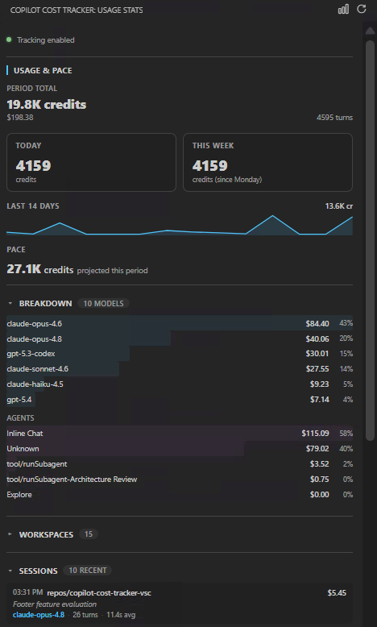
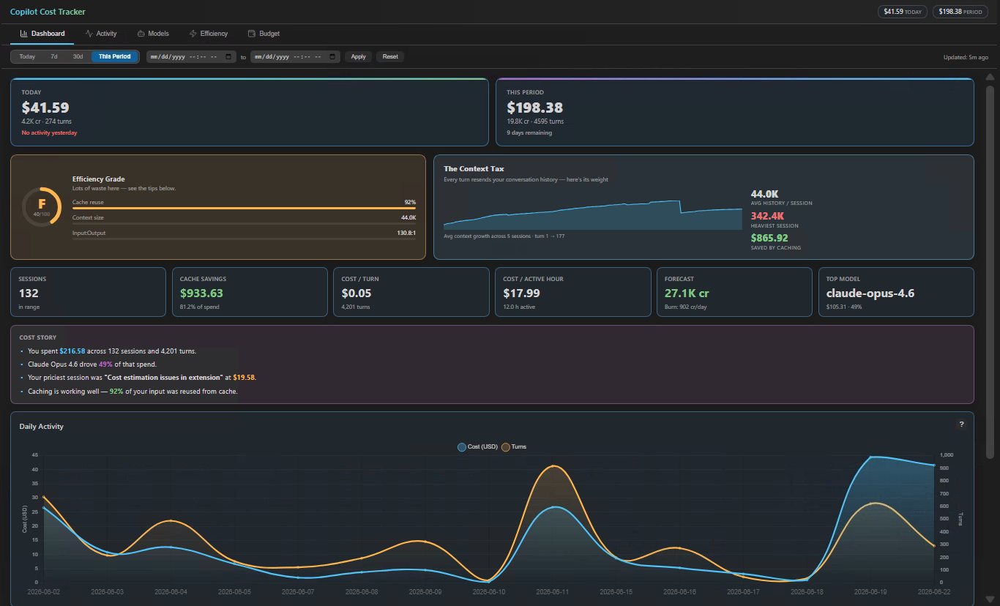

# Copilot Cost Tracker

[](https://github.com/Hoxlegion/copilot-cost-tracker-vsc/releases)
[](LICENSE)
[](https://code.visualstudio.com/)

💰 **Real-time cost tracking for your GitHub Copilot usage. See exactly what you are spending as you work.**

Get live updates on AI credit consumption with an always-visible status bar, budget alerts, and dashboards. No API keys required.

> ⚠️ **Requires VS Code settings change** [Setup <30 seconds](#requirements)

---

## Table of Contents

- [Features](#features)
- [Screenshots](#screenshots)
- [Requirements](#requirements)
- [Installation](#installation)
- [Quick Start](#quick-start)
- [Essential Configuration](#essential-configuration)
- [Commands](#commands)
- [UI Components](#ui-components)
- [Troubleshooting](#troubleshooting)
- [Advanced: Pricing & Configuration](#advanced-pricing--configuration)
- [Architecture](#architecture)
- [Development](#development)
- [Contributing](#contributing)
- [License](#license)

---

## Features

| Feature | Description |
|---------|-------------|
| Live status bar | Session delta (`+2.3 cr`) and period total (`42.5 cr`) updated as you work |
| Budget threshold alerts | One-time VS Code notifications at configurable % thresholds (default: 75%, 90%, 100%) |
| Rich sidebar panel | Styled overview: budget bar, 14-day sparkline, today/week, pace, model & workspace breakdowns, recent sessions |
| Dashboard webview | 5-tab Chart.js dashboard: Dashboard, Activity, Models, Efficiency, Budget |
| Efficiency Grade | A–F grade with gauge, scoring cache reuse, context size, and input:output ratio |
| Context Tax visualization | Signature view of how much conversation history each turn resends, with average growth curve |
| Cost Story digest | Plain-language summary of your spend, top model, priciest session, and cache health |
| Productivity metrics | Cost per turn and cost per active hour, alongside cache savings and forecast |
| Theme-aware UI | Charts, legends, and tooltips adapt to light and dark VS Code themes |
| Global date filtering | Filter all dashboard tabs by custom date range (Today, 7d, 30d, This Period, or custom) |
| Reactive dashboard | All tabs update instantly when filter changes, no page reload needed |
| Accurate model attribution | Per-model cost split across multi-model sessions, not just the session's primary model |
| Workspace focus insights | Top workspace card + workspace leaderboard for current range |
| Turn Explorer analytics | Turn-level discovery with LLM calls, tool calls, cache %, expand/collapse, and filters |
| Cache savings visibility | Range-level savings card with model breakdown |
| Billing period tracking | Correct period boundaries for any `billingCycleStartDay`, including short months |
| Multi-model prices | Built-in rates for all June 2026 GA models from OpenAI, Anthropic, Google, GitHub |
| Custom model rates | Define credits-per-1M-tokens for models not in the built-in table |
| Model exclusion | Filter out models you don't want tracked (default: `gpt-4o-mini` code completions) |
| Context weight notifications | Warnings at 20K, 40K, 80K tokens when active sessions accumulate heavy context |
| Context awareness alerts | Identifies patterns: micro-turn bloat, raw paste, premium model misallocation, agent sprawl |
| File watcher strategy | Event-driven updates with 2s debounce for near-instant status bar refresh (sub-second after data arrival) |
| Response latency metrics | Tracks model response times and displays avg latency and P90 per model |
| DB + JSONL failover | Reads `agent-traces.db` directly; falls back to JSONL debug logs automatically |
| Watermark recovery | On restart, resumes from the last processed timestamp — no duplicate counting |
| Periodic persistence | In-memory SQLite flushed to disk every 60 seconds |

---

## Screenshots

### Status Bar for Live Cost Tracking
See session delta (+2.3 credits) and period total in real time.


### Cost Overview Sidebar
Styled panel: budget bar, 14-day sparkline, today/week, pace, and model/workspace breakdowns.



### Dashboard (5-tab analytics)
Dashboard hero with Efficiency Grade and Context Tax, plus Activity, Models, Efficiency, and Budget tabs.


Includes global date range filters, sorting, and detailed breakdowns.

---

## Requirements

Copilot Chat must have this telemetry setting enabled so usage data is written for this extension to read:
The extension attempts to enable this automatically on activation.
If VS Code policy/settings scope blocks automatic updates, set it manually.

```jsonc
"github.copilot.chat.otel.dbSpanExporter.enabled": true
```

**That's it.** The extension reads data that Copilot Chat already creates - no external APIs or authentication needed.

*(Optional: enable JSONL fallback logs if the database becomes unavailable)*

---

## Installation

### From VS Code Marketplace
1. Open **Extensions** in VS Code (`Ctrl+Shift+X`)
2. Search: **Copilot Cost Tracker**
3. Click **Install**

### From VSIX (Manual)
```bash
code --install-extension copilot-cost-tracker-0.6.2.vsix
```

### From Source
```bash
git clone https://github.com/Hoxlegion/copilot-cost-tracker-vsc.git
cd copilot-cost-tracker
npm install
npm run package
code --install-extension copilot-cost-tracker-0.6.2.vsix
```

---

## Quick Start

**3 steps:**

1. **Verify telemetry setting** (usually automatic)  
  On activation, the extension attempts to set this to `true` automatically.  
  If needed, set it manually in `settings.json`:
   ```jsonc
   "github.copilot.chat.otel.dbSpanExporter.enabled": true
   ```
  Then restart VS Code if you still don't see data.

2. **Open the extension**  
   Click the **Copilot Cost Tracker** icon in the Activity Bar (left sidebar).

3. **Start coding**  
   Use Copilot normally. Credits appear in real-time at the bottom status bar.

---

## Essential Configuration

Most users won't need to change anything. These are the most common settings:

| Setting | Type | Default | What it does |
|---------|------|---------|-------------|
| `budgetCredits` | number | `180` | Your monthly AI credit budget (used for alerts & progress bar). Set to `0` to disable budget tracking. |
| `billingCycleStartDay` | number | `1` | Day of month your billing resets (1–31) |
| `budgetWarningThresholds` | array | `[75, 90, 100]` | % thresholds for VS Code notifications |
| `currency` | string | `"USD"` | Display currency code |
| `showStatusBar` | boolean | `true` | Show cost in status bar |
| `contextWeightNotifications` | boolean | `true` | Show warnings for heavy context (20K, 40K, 80K tokens) |
| `microTurnGapSeconds` | number | `120` | Max seconds between turns for micro-turn pattern detection |
| `microTurnMinCount` | number | `5` | Consecutive rapid turns to trigger Micro-Turn Bloat alert |
| `rawPasteMinInputTokens` | number | `15000` | Min uncached tokens in a turn to trigger Raw Paste alert |
| `premiumMisallocationMinCredits` | number | `2` | Min credits for Premium Model Misallocation alert |
| `agentSprawlMinInputTokens` | number | `80000` | Min input tokens to trigger Massive Context Turn alert |

See the [Advanced: Pricing & Configuration](#advanced-pricing--configuration) section below for the full settings reference.

---

## Commands

Accessible via the Command Palette (`Ctrl+Shift+P`) under the **Copilot Cost Tracker** category.

| Command | Description |
|---------|-------------|
| `Copilot Cost Tracker: Refresh Cost Data` | Forces a full ingest, refreshes pricing, updates all UI. |
| `Copilot Cost Tracker: Open Dashboard` | Opens the webview dashboard in a side panel. |
| `Copilot Cost Tracker: Scan All Workspaces` | Ingests all available data without watermark restriction. |
| `Copilot Cost Tracker: Scan Full History` | Ingests from timestamp 0 — backfills the entire available history. |

---

## UI Components

### Status Bar
Displays at the bottom of VS Code:
```
$(credit-card) +$0.42 | $4.25 | $(brain) 35K
```
- **`+$0.42`** — USD spent in the current session (since activation)
- **`$4.25`** — Total spend this billing period
- **`$(brain) 35K`** — Active chat context weight (tokens)
- Color-coded by budget thresholds and pacing (yellow when approaching, red when over)
- Click for a quick menu: period summary, context, top models, dashboard, refresh, settings

### Cost Overview Sidebar
Styled panel in the Activity Bar:
- Budget bar with % used and reset date
- 14-day credit sparkline
- Today / This Week totals and projected pace
- Model and workspace breakdowns
- Recent sessions with cost, model, and turn counts

### Dashboard
5-tab webview with Chart.js visualizations and global date range filtering:
- **Dashboard**: Today/period hero cards, Efficiency Grade (A–F), Context Tax visualization, Cost Story digest, productivity metrics (cost/turn, cost/active hour), cache savings, forecast, daily activity chart, cost drivers, and smart alerts
- **Activity**: Activity heatmap, workspace filter, recent sessions, sessions table, and a Turn Explorer with per-turn LLM/tool calls and cache %
- **Models**: Per-model cost breakdown (accurate across multi-model sessions) with avg credits/turn, token usage, cache %, avg and P90 latency, plus bar/pie/token-flow charts
- **Efficiency**: Optimization score, cache/context/IO metrics, context scatter & growth charts, surface breakdown, alerts, and a savings playbook
- **Budget**: Budget gauge, pacing status, forecast, and timeline

All tabs respond to the global date range filter for focused analysis.

The Turn Explorer (Activity tab) includes:
- `Expand all` / `Collapse all`
- `Only rows with tools` filter
- `Only anomalies` filter (cache hit < 40% or turn used tools)
- Last Active timestamp for each turn

Open via **Copilot Cost Tracker: Open Dashboard** command or the graph icon in the sidebar.

---

## Troubleshooting

**No data appears / sidebar is empty**
1. Verify the required VS Code setting is enabled (see [Requirements](#requirements))
2. Restart VS Code
3. Set `logLevel` to `"info"` in settings and check the **Copilot Cost Tracker** Output Channel
4. Run **Copilot Cost Tracker: Scan Full History** to force a backfill

**Cost appears wrong for a model**
- Add custom rates via `copilotCostTracker.customModelRates` setting
- Unknown models default to GPT-5.4-tier fallback rates; check logs for warnings

**Budget period shows wrong start date**
- Verify `billingCycleStartDay` matches your GitHub billing cycle (GitHub → Settings → Billing and plans)
- If `startDay=31` and the month has fewer days, it correctly uses the last day of that month

**Extension not activating**
- Requires VS Code `^1.85.0`
- Loads after VS Code startup (a few seconds), not instantly
- Check VS Code Developer Console (`Help → Toggle Developer Tools`) for errors

---

## Advanced: Pricing & Configuration

### Full Configuration Reference
All settings under `copilotCostTracker.*`:
- **Billing**: `billingCycleStartDay`, `budgetCredits`, `budgetWarningThresholds`
- **Pricing**: `customModelRates`, `excludedModels`, `pricingUrl`  
- **Data**: `telemetrySource`, `pollIntervalMin`, `pollIntervalMax`, `initialScanDays`
- **Display**: `currency`, `exchangeRate`, `showStatusBar`
- **Debug**: `logLevel`

Tip: open VS Code Settings and search for `copilotCostTracker.` to browse all available options.

### Built-in Pricing Rates (June 2026)
Official rates for OpenAI, Anthropic, Google, GitHub models:
- **OpenAI**: GPT-5.5, GPT-5.4, GPT-5-mini, etc.
- **Anthropic**: Claude Opus/Sonnet/Haiku with cache support
- **Google**: Gemini models
- **GitHub**: Copilot fine-tuned models

Define custom rates for unlisted models:
```jsonc
"copilotCostTracker.customModelRates": {
  "my-model": { "input": 150, "output": 600 }
}
```

---

## Architecture

This extension is built with:
- **sql.js**: In-memory SQLite database (zero external runtime dependencies)
- **VS Code API**: Settings, status bar, webview, Output Channel
- **Svelte**: Reactive dashboard webview with component-based architecture
- **Chart.js**: Dashboard visualizations
- **File watcher strategy**: Event-driven file monitoring with debouncing for responsive UI updates
- **Context tracking**: Real-time session context weight monitoring with granular alerts

Data flows from VS Code's internal telemetry → traces database → cost calculation → in-memory DB → UI.

For deeper implementation details, inspect the source under `src/` and tests under `test/`.

---

## Development

### Quick Start

```bash
git clone https://github.com/Hoxlegion/copilot-cost-tracker-vsc.git
cd copilot-cost-tracker
npm install
npm run watch          # Rebuilds on changes
code .                 # Open in VS Code
```

Press `F5` to launch extension in a debug window.

### Build & Package

```bash
npm run build          # Development build with source maps
npm run package        # Create .vsix file for distribution
npm test               # Run unit tests (vitest)
npm run test:watch     # Watch mode
npm run deploy:local   # Builds and installs to local VS Code
```

### Project Structure

```
src/
  extension.ts         # Entry point, wires all modules
  config.ts           # Settings management
  billing.ts          # Billing period calculations
  database/           # In-memory SQL database
  parser/             # Trace data parsing
  pricing/            # Cost calculation engine
  watcher/            # Data polling & ingestion
  views/              # UI: status bar, sidebar, dashboard
    helpers/          # View helper functions
  webview/            # Svelte dashboard application
    components/
      charts/         # Chart.js wrappers (Daily, Heatmap, Model, Context charts)
      shared/         # Reusable components (StatCard, BudgetBar, DataTable, GlobalFilter,
                      #   EfficiencyGrade, ContextCostHero, CostStory)
      tabs/           # Tab components (Dashboard, Activity, Models, Efficiency, Budget)
    stores/           # Svelte stores (dashboard data, filter state)
    utils/            # Formatting, palette, chart styles, model aggregation
    types.ts          # TypeScript interfaces
test/
  billing.test.ts     # Billing period calculation tests
```

See the `src/` folders above for module boundaries and ownership.

---

## Contributing

Pull requests welcome! Please:
1. Follow the existing code style and run `npm run lint`
2. Add tests for new features
3. Update docs if behavior changes
4. Reference any GitHub issues in commit messages

---
---

## License

MIT License — see [LICENSE](LICENSE)
