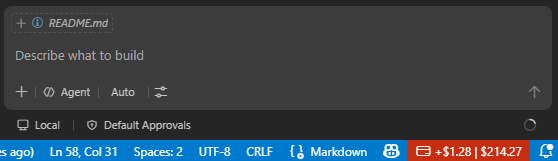
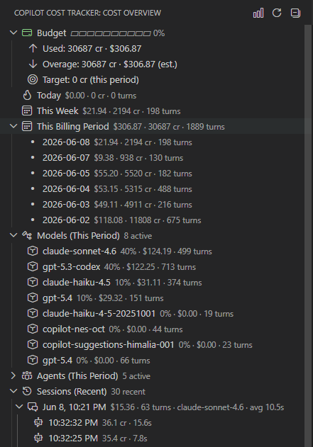
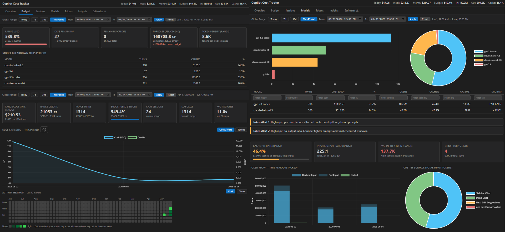

# Copilot Cost Tracker

[](https://github.com/yourusername/copilot-cost-tracker/releases)
[](LICENSE)
[](https://code.visualstudio.com/)

💰 **Real-time cost tracking for your GitHub Copilot usage, see exactly what you're spending, as you work.**

Get live updates on your AI credit consumption with an always-visible status bar, budget alerts, and dashboards. Requires no API keys.

> ⚠️ **Requires VS Code settings change** [Setup <30 seconds](#requirements)


---

## Table of Contents

- [Features](#features)
- [Screenshots](#screenshots)
- [Requirements](#requirements)
- [Installation](#installation)
- [Quick Start](#quick-start)
- [Essential Configuration](#essential-configuration)
- [Commands](#commands)
- [UI Components](#ui-components)
- [Troubleshooting](#troubleshooting)
- [Advanced: Pricing & Configuration](#advanced-pricing--configuration)
- [Architecture](#architecture)
- [Development](#development)
- [Contributing](#contributing)
- [License](#license)

---

## Features

| Feature | Description |
|---------|-------------|
| Live status bar | Session delta (`+2.3 cr`) and period total (`42.5 cr`) updated as you work |
| Budget threshold alerts | One-time VS Code notifications at configurable % thresholds (default: 75%, 90%, 100%) |
| Cost tree view | Hierarchical sidebar: budget → today/week/month → models → sessions |
| Dashboard webview | 7-tab Chart.js dashboard: Overview, Budget health, Sessions, Models, Tokens, Insights, Estimates |
| Workspace focus insights | Top workspace card + workspace leaderboard for current range |
| Discovery turn analytics | Turn-level discovery with LLM calls, tool calls, cache %, expand/collapse, and filters |
| Cache savings visibility | Period-level savings card with model breakdown |
| Billing period tracking | Correct period boundaries for any `billingCycleStartDay`, including short months |
| Multi-model pricing | Built-in rates for all June 2026 GA models from OpenAI, Anthropic, Google, GitHub |
| Custom model rates | Define credits-per-1M-tokens for models not in the built-in table |
| Model exclusion | Filter out models you don't want tracked (default: `gpt-4o-mini` code completions) |
| Adaptive polling | Interval doubles when idle (up to `pollIntervalMax`), resets immediately on new data |
| DB + JSONL failover | Reads `agent-traces.db` directly; falls back to JSONL debug logs automatically |
| Watermark recovery | On restart, resumes from the last processed timestamp — no duplicate counting |
| Periodic persistence | In-memory SQLite flushed to disk every 60 seconds |

---

## Screenshots

### Status Bar for Live cost tracking
See session delta (+2.3 credits) and period total in real time.



-----------

### Cost Overview Tree
Hierarchical breakdown: budget → period → models → sessions.



--------------------------------

### Dashboard (7-tab analytics)
Quick overview, Budget tracking, Sessions list, model/token analytics, and curated Insights with discovery views.


Includes filters, sorting, and detailed breakdowns.

---

## Requirements

Your VS Code must have these telemetry settings enabled so Copilot Chat writes usage data that this extension reads:

```jsonc
"github.copilot.chat.otel.dbSpanExporter.enabled": true
```

**That's it.** The extension reads data that Copilot Chat already creates no external APIs or authentication needed.

*(Optional: enable JSONL fallback logs if the database becomes unavailable)*

---

## Installation

### From VS Code Marketplace
Simple:
1. Open **Extensions** in VS Code (`Ctrl+Shift+X`)
2. Search: **Copilot Cost Tracker**
3. Click **Install**

### From VSIX (Manual)
```bash
code --install-extension copilot-cost-tracker-0.2.0.vsix
```

### From Source
```bash
git clone https://github.com/yourusername/copilot-cost-tracker.git
cd copilot-cost-tracker
npm install
npm run package
code --install-extension copilot-cost-tracker-0.2.0.vsix
```

---

## Quick Start

**3 steps:**

1. **Add VS Code setting** (required)  
   Open VS Code Settings, search `copilot.chat.otel.dbSpanExporter`, set to `true`.  
   Or add to `settings.json`:
   ```jsonc
   "github.copilot.chat.otel.dbSpanExporter.enabled": true
   ```
   Then restart VS Code.

2. **Open the extension**  
   Click the **Copilot Cost Tracker** icon in the Activity Bar (left sidebar).

3. **Start coding**  
   Use Copilot normally. Credits appear in real-time at the bottom status bar.

---

## Essential Configuration

Most users won't need to change anything. These are the most common settings:

| Setting | Type | Default | What it does |
|---------|------|---------|-------------|
| `budgetCredits` | number | `180` | Your monthly AI credit budget (used for alerts & progress bar) |
| `billingCycleStartDay` | number | `1` | Day of month your billing resets (1–31) |
| `budgetWarningThresholds` | array | `[75, 90, 100]` | % thresholds for VS Code notifications |
| `currency` | string | `"USD"` | Display currency code |
| `showStatusBar` | boolean | `true` | Show cost in status bar |

**→ [View all 20+ configuration options](docs/CONFIGURATION.md)** (polling, pricing, diagnostics, etc.)

---

## Commands

Accessible via the Command Palette (`Ctrl+Shift+P`) under the **Copilot Cost Tracker** category.

| Command | Description |
|---------|-------------|
| `Copilot Cost Tracker: Refresh Cost Data` | Forces a full ingest, refreshes pricing, updates all UI. |
| `Copilot Cost Tracker: Open Dashboard` | Opens the webview dashboard in a side panel. |
| `Copilot Cost Tracker: Scan All Workspaces` | Ingests all available data without watermark restriction. |
| `Copilot Cost Tracker: Scan Full History` | Ingests from timestamp 0 — backfills the entire available history. |

---

## UI Components

### Status Bar
Displays at the bottom of VS Code:
```
$(credit-card)  +2.3 | 42.5 cr
```
- **`+2.3`** — Credits consumed in current session
- **`42.5 cr`** — Total credits this billing period
- Color-coded: yellow at 75%, red at 90%, based on budget

### Cost Overview Tree
Hierarchical sidebar view:
- Budget % and remaining
- Today / This Week / This Month breakdowns
- Models and sessions with turn counts

### Dashboard
7-tab webview with Chart.js visualizations:
- **Overview**: Daily spend, budget context, cache savings, top workspace
- **Budget**: Period progress, allowance/day
- **Sessions**: Table of all sessions with cost
- **Models**: Cost breakdown by model
- **Tokens**: Input/output/cached token charts
- **Insights**: Workspace focus, action-type spend breakdown, turn discovery (LLM/tool call view)
- **Estimates**: Time/cost heuristics (speculative)

Discovery in Insights includes:
- `Expand all` / `Collapse all`
- `Only rows with tools` filter
- `Only anomalies` filter (cache hit < 40% or turn used tools)
- Click-through from discovery/session snapshots to the Sessions tab

Open via **Copilot Cost Tracker: Open Dashboard** command or the graph icon in the tree view.

---

## Troubleshooting

**No data appears / tree view is empty**
1. Verify the required VS Code setting is enabled (see [Requirements](#requirements))
2. Restart VS Code
3. Set `logLevel` to `"info"` in settings and check the **Copilot Cost Tracker** Output Channel
4. Run **Copilot Cost Tracker: Scan Full History** to force a backfill

**Cost appears wrong for a model**
- Add custom rates via `copilotCostTracker.customModelRates` setting
- Unknown models default to GPT-4o rates; check logs for warnings

**Budget period shows wrong start date**
- Verify `billingCycleStartDay` matches your GitHub billing cycle (GitHub → Settings → Billing and plans)
- If `startDay=31` and the month has fewer days, it correctly uses the last day of that month

**Extension not activating**
- Requires VS Code `^1.85.0`
- Loads after VS Code startup (a few seconds), not instantly
- Check VS Code Developer Console (`Help → Toggle Developer Tools`) for errors

---

## Advanced: Pricing & Configuration

### Full Configuration Reference
All settings under `copilotCostTracker.*`:
- **Billing**: `billingCycleStartDay`, `budgetCredits`, `budgetWarningThresholds`
- **Pricing**: `customModelRates`, `excludedModels`, `pricingUrl`  
- **Data**: `telemetrySource`, `pollIntervalMin`, `pollIntervalMax`, `initialScanDays`
- **Display**: `currency`, `exchangeRate`, `exchangeRate`, `showStatusBar`
- **Debug**: `logLevel`

**→ [View detailed configuration docs](docs/CONFIGURATION.md)**

### Built-in Pricing Rates (June 2026)
Official rates for OpenAI, Anthropic, Google, GitHub models:
- **OpenAI**: GPT-5.5, GPT-5.4, GPT-5-mini, etc.
- **Anthropic**: Claude Opus/Sonnet/Haiku with cache support
- **Google**: Gemini models
- **GitHub**: Copilot fine-tuned models

Define custom rates for unlisted models:
```jsonc
"copilotCostTracker.customModelRates": {
  "my-model": { "input": 150, "output": 600 }
}
```

**→ [View complete pricing table](docs/PRICING.md)**

---

## Architecture

This extension is built with:
- **sql.js**: In-memory SQLite database (zero external runtime dependencies)
- **VS Code API**: Settings, status bar, webview, Output Channel
- **Chart.js**: Dashboard visualizations
- **Adaptive polling**: Responsive during use, silent when idle

Data flows from VS Code's internal telemetry → traces database → cost calculation → in-memory DB → UI.

For deep technical details on data flow, modules, persistence, and billing period logic:

**→ [Read ARCHITECTURE.md](.context/ublang.md)**

---

## Development

### Quick Start

```bash
git clone https://github.com/yourusername/copilot-cost-tracker.git
cd copilot-cost-tracker
npm install
npm run watch          # Rebuilds on changes
code .                 # Open in VS Code
```

Press `F5` to launch extension in a debug window.

### Build & Package

```bash
npm run build          # Development build with source maps
npm run package        # Create .vsix file for distribution
npm test               # Run unit tests (vitest)
npm run test:watch     # Watch mode
```

### Project Structure

```
src/
  extension.ts         # Entry point, wires all modules
  config.ts           # Settings management
  billing.ts          # Billing period calculations
  database/           # In-memory SQL database
  parser/             # Trace data parsing
  pricing/            # Cost calculation engine
  watcher/            # Data polling & ingestion
  views/              # UI: status bar, tree, dashboard
test/
  billing.test.ts     # 15 unit tests for billing math
```

See [ARCHITECTURE.md](.context/ublang.md) for full module documentation.

### TypeScript & Type Safety

`tsconfig.json` uses `strict: true`. There are 8 pre-existing type errors from `sql.js` (no TypeScript declarations), but these don't affect the build. To fix:

```bash
# Add declaration file
echo "declare module 'sql.js';" > src/sql-js.d.ts
```

---

## Contributing

Pull requests welcome! Please:
1. Follow the existing code style (Prettier + ESLint config included)
2. Add tests for new features
3. Update docs if behavior changes
4. Reference any GitHub issues in commit messages

For architectural decisions and design notes, see [.context/ublang.md](.context/ublang.md).

---

---

## License

MIT License — see [LICENSE](LICENSE)
